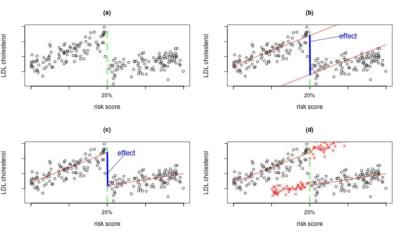

## Introduction
The **Regression Discontinuity Design** (RDD) is an econometric quasi-experimental design aimed at estimating the causal effects of a treatment by exploiting naturally occurring treatment rules. This design can be applied in any context where a particular treatment is administered according to a pre-specified rule (guideline) linked to a continuous variable. Such thresholds often exist in primary care in the context of drug prescription. Examples include the prescription of anti-hypertensive drugs when blood pressure exceeds 140/90 mmHg and prescription of selective serotonin uptake inhibitors (SSRIs) for patients exhibiting more than 4 symptoms in the ICD-10 classification of depression. 

<div style="text-align:center;">

</div>

When guidelines are strictly adhered to, as in (a)-(c) above, then the RDD is termed “sharp”. However, although well defined guidelines may exist, these are not always followed in clinical practice. In this case the RDD is termed “fuzzy”, eg in (d): crosses represent patients who are not receiving the treatment as per the guidelines. 

The aim of this project, funded by the [MRC Methodology Panel](http://www.mrc.ac.uk/Ourresearch/ResearchInitiatives/Methodologyresearch/programme/index.htm), is to develop and implement the RDD for epidemiological research. Our specific objectives are to:

* develop a RDD methodology suited to estimating the effect of prescriptions and interventions with particular focus on developing RDD methods for binary outcomes such as mortality;
* compare the effects of statin prescribed in primary care to that estimated from randomised controlled trials;
* develop guidelines and software for RDD analysis in epidemiological research.

The project officially started in September 2013 and lasted for 30 months.  
<br><br>

<div style="text-align: right; font-size: 12px; color:gray; font-weight: bold; font-style: italic;"> Last updated: `r format(Sys.Date(),"%A %d %B %Y")` </div>

```{r, echo=FALSE,child=here::here("research/refs.qmd")}
```
