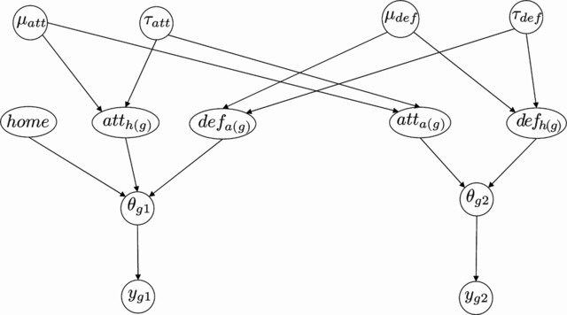

## Introduction
The problem of modelling football data has become increasingly popular in the last few years and many different models have been proposed with the aim of estimating the characteristics that bring a team to lose or win a game, or to predict the score of a particular match. We have worked within a Bayesian hierarchical framework to fulfil both these aims and test the predictive strength of our resulting models, based on several observed datasets. In our first paper [@BaioBlangiardo:2010], we have used data about the Italian Serie A 1991–1992 and 2007–2008 championships.

We have then applied a similar version of this model to the FIFA World Cup 2014. In that case, we have used historical data on friendly, qualifiers and major competition games at the international level to model the results of the World Cup. We have run the model dynamically to continuously update the predictions based on the results that were observed during the competition and our results have been reported in a series of posts, starting from [here](https://gianlubaio.blogspot.co.uk/2014/06/the-oracle-1.html). Finally, I have used a more complex version of the model, including a few relevant covariates, to model data on a variety of leagues and seasons. This work has then been written up in @Tsakosetal:2017.

## Modelling
The basic structure of the model is represented in the following graph.


Here, the two observed variables ($y_{g1}$ and $y_{g2}$) represent the number of goals scored by teams $t=1,2$ in game $g=1,\ldots,G$. We model these using two Poisson distributions, $y_{gt}\sim\mbox{Poisson}(\theta_{gt})$ and then we impose a structure on the joint distribution of the ``scoring rates'' $\theta_{gt}$. These depend on some common effects \textit{att} and \textit{def} --- here the nested indices $h(g)$ and $a(g)$ indicate the team playing home or away in game $g$. These are in turn assumed to be exchangeable across the teams in a given season/league and thus we imply some correlation across the observable variables.

Our original model was fitted using MCMC in <tt>OpenBUGS</tt>. In @BaioBlangiardo:2010 we also discuss issues with ``overshrinkage'' produced by the Bayesian hierarchical model, where predictions for the most extreme teams (either the very good or the very bad ones) were pooled too much towards the grand mean, thus diluting some of the differences in the league. To alleviate this problem, we specify a more complex mixture model that results in a better fit to the observed data. 

Our later versions of the model have been constructed in <tt>INLA</tt>, to speed up the analysis and deal with much larger datasets. The basic structure of the model has not been changed.
<br><br>

<div style="text-align: right; font-size: 12px; color:gray; font-weight: bold; font-style: italic;"> Last updated: `r format(Sys.Date(),"%A %d %B %Y")` </div>


```{r, echo=FALSE,child=here::here("research/refs.qmd")}
```

