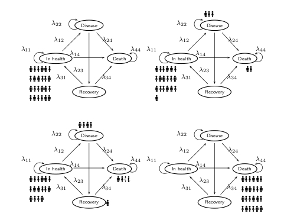

## Introduction
Human papilloma virus (HPV) is known to be an important factor in the development of invasive cervical cancer and other malignant and bening neoplastic lesions, affecting the vulva, vagina, anus, penis, head/neck, lungs and external genital area. Vaccination against particular strains of HPV has been recently made available; however, the actual cost-effectiveness of vaccination strategies (specifically, in our case, using the quadrivalent vaccine, which acts against 4 HPV strains) is generally subject to large uncertainty.

The aim of this research project is to investigate the cost-effectiveness of several vaccination strategies using Bayesian Markov models (eg like the one described in the graph below), a tool that is particularly relevant in health economic evaluation to describe the natural history of a disease (and its management). Cost and clinical utilities are attached to each clinical states.

<div style="text-align:center;">
{ height="40%" width="40%"}
</div>

We are developing a comprehensive research programme, which aims at investigating complex structures describing the characteristics of the disease as well as potential differential strategies for the application of the vaccination. 

This work has been used as part of the evidence base considered by the Italian Government to modify the national regulation on HPV vaccination, which in the Summer of 2017 has sanctioned the expansion of the vaccination programme to cover both girls and boys.
<br><br>

<div style="text-align: right; font-size: 12px; color:gray; font-weight: bold; font-style: italic;"> Last updated: `r format(Sys.Date(),"%A %d %B %Y")` </div>

```{r, echo=FALSE,child=here::here("research/refs.qmd")}
```

