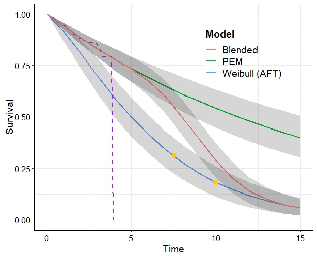

## Introduction
Survival analysis is an essential component of the health economic evaluation of new interventions. In fact, many of the technical appraisals performed by bodies such as NICE involve evaluations based on some form of time-to-event analysis, for instance when dealing with cancer drugs. More specifically, cost-effectiveness analyses (CEAs) require estimating the difference in _mean_ survival times between arms (rather than median, which is more common in "standard" biostatistics analysis), in order to quantify the long term economic benefits of a new intervention. New treatments and drugs often impact life expectancy and/or quality of life for periods longer in duration than the randomised clinical trials (RCTs) from which the experimental data are obtained. Hence, obtained survival curves are usually right-censored and inadequate to determine long term costs and outcomes. In health-economic evaluations, curves must be extrapolated to a much longer time horizon in order to compute the mean time-to-event.

Often, the process of survival analysis is rendered even more complicated by the fact that the data may not be informative enough to estimate long-term extrapolation, as well as the need to perform parametric estimates, without clear guidance as to which, in a set of suitable candidates, is the "best" model (not only in terms of the fit to the observed data, but over the entire extrapolation period).

This work will explore several issues, including the expansion of standard three-stage Markov models for cancer drugs using underlying [_partitioned survival analysis_](http://nicedsu.org.uk/technical-support-documents/partitioned-survival-analysis-tsd/) within a full Bayesian approach, to provide improvements in the modelling, estimation and economic evaluation. The work will be closely linked with the development and improvement of [survHE](../../software/survhe/).

### (1) Blended survival models
#### With Zhaojing Che and [Nathan Green](https://www.ucl.ac.uk/statistics/dr-nathan-green)
This main idea is based on “blending” survival curves as a possible solution to the problem of unrealistic extrapolation deriving from limited data (eg subject to large censoring or short follow up). 

The basic idea is to mix a flexible model (eg, but not necessarily, a Cox semi-parametric) to fit as well as possible the observed data and a parametric model encoding assumptions on the expected behaviour of underlying long-term survival. The two are “blended” into a single survival curve that is identical with the flexible model over the range of observed times and increasingly similar to the parametric model over the extrapolation period. 

If there is access to patient-level long-term data from cancer registries or hospital-based cohorts, underlying parametric models could be fitted to external source, then we can blend two distributions based effectively on different datasets. Here, we focus on more common cases   such that only indicative information are available. More generally, external information consist of a defensible clinical belief that the risks of death will continue in a particular way in the long term. 

For example, if 5-year survival for a particular disease is regarded as 10\(\%\) from registry, neither 0\(\%\) nor 40\(\%\) survival estimate from parametric models should be appropriate at 5 years. We will express the elicited information as an artificial extra data set, then using parametric models to construct external long-term survival curve. 



<br>

### (2) Computationally efficient methods for survival modelling in HTA
#### With Luke Hardcastle and [Sam Livingstone](https://samueljlivingstone.wixsite.com/webpage)
[`survHE`](../../software/survHE) provides a streamlined environment for fully Bayesian modelling, with inference performed using an adaptive version of Hamiltonian Monte Carlo (HMC). HMC is part of a wider set of Markov Chain Monte Carlo methods that use gradient information to inform proposals within a Metropolis-Hastings algorithm, and it is a particularly efficient algorithm when the parameter space is high-dimensional.

Compared to Gibbs Sampling (which is still commonly used in survival analysis through software such as [`BUGS`](https://www.mrc-bsu.cam.ac.uk/software/bugs/openbugs/) and [`JAGS`](https://mcmc-jags.sourceforge.io/)), HMC makes these gains by updating all the model parameters at once rather than one by one. Further, high-dimensional scaling arguments have also shown it is more efficient than simpler random-walk Metropolis-Hastings algorithms and other gradient-based methods. 

However, while efficient, HMC can be extremely sensitive to the choice of initial tuning parameters especially in comparison to simpler schemes such as the random-walk Metropolis algorithm, often resulting in issues with convergence. This means it either requires significant user input to adjust tuning parameters or the use of adaptive schemes, which can impact efficiency (as developed in the `R` package [`rstan`](https://mc-stan.org/users/interfaces/rstan)). A newly proposed gradient-based scheme, [the Barker proposal](https://arxiv.org/abs/1908.11812.pdf), has been shown to share the robustness to tuning of the random-walk algorithm, whilst being as efficient as other gradient-based methods and almost as efficient as HMC. Simulation studies have shown that this benefit is most pronounced in the case of adaptive MCMC with the Barker proposal being particularly robust to tuning in this setting. 

We explore these algorithms and methods using a variety of HTA-based cases (inclusing the existince of multiple hazards, eg in the case of PolyWeibull distributions, or in hierarchical structures, such as the application of modelling in basket trials).

<br><br>


<div style="text-align: right; font-size: 12px; color:gray; font-weight: bold; font-style: italic;"> Last updated: `r format(Sys.Date(),"%A %d %B %Y")` </div>

```{r, echo=FALSE,child=here::here("research/refs.qmd")}
```
